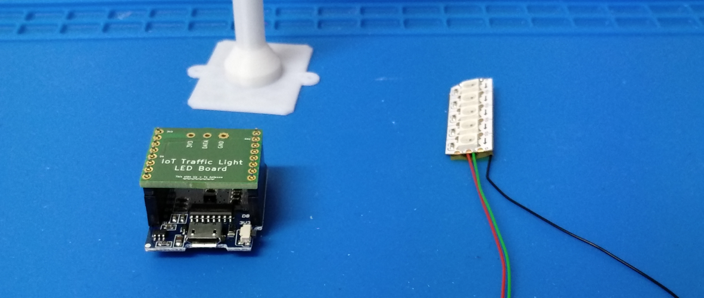

# IoT Traffic Light Assembly

## Overview

This document describes the assembly steps to build the traffic light and the sensor:


## Sensor
### Overview


### Steps


### Testing
Flash the `sensor-demo.ino` project to the D1 mini.

See Arduino Settings at the bottom of this document.

Open the serial monitor ( Tools -> Serial Monitor), and verify the output:

```
Temp: 21.56°C		Humidity: 33.30% RH		Pressure: 99364.14 Pa
```


### Traffic Light

## Overview

*Note:* The colors of the cables will be different! ⚠️

## Steps





Soldering the LED wires to the Board will be the last step.
Twist the wires before pushing them throught the lamp post, then solder to the board.

### Testing

Flash the `traffic-light-demo.ino` project to the D1 mini.

See Arduino Settings below.

## Arduino Settings

Configure the Arduino IDE to flash to the D1 mini target:


