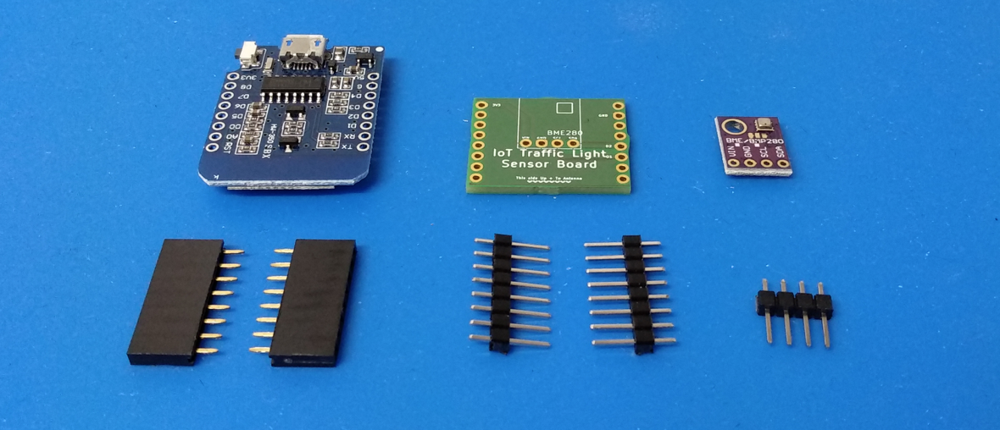

# IoT Traffic Light Assembly

## Overview

This document describes the assembly steps to build the traffic light and the sensor:


## 3D Prints
You can find the .STL files on [Thingiverse](https://www.thingiverse.com/thing:2463193)

## PCBs
You can order the PCBs from Aisler.net:
- [Sensor Board](https://aisler.net/uvwxy/iot-traffic-light/sensor-board)
- [LED Board](https://aisler.net/uvwxy/iot-traffic-light/led-board)

## Sensor Assembly
The sensor module consists of
- Wemos D1 mini (ESP8266)
- Bosch BME280
- a PCB
- a case
- pins to connect everything

### Overview


### Steps
**1.** Get familliar with the parts and organize them in front of you. The base module (or mainboard/controlelr) is the blue board (Wemos D1mini). 


**2.** Attach and solder the two 8x1 female pin headers to the D1mini, such that the metal shield / antenna points to the ground. Make sure they are orthognal (or straight) on the board.


**3.** Insert the male pins into the two soldered rows.


**4.** Attach and solder the pcb to the pins. Make sure the board is oriented correctly. (See the small helper text on the PCB).


**5.** Attach and solder the 4x1 pins to the PCB. You might need to remove the PCB and flip it over to reach to the pads under the board ;).


**6.** Attach and solder the sensor as depicted in the image to the 4x1 pins. The tiny silver box on the purple PCB needs to point up.


Result: The sensor in the case.


### Testing
Flash the `sensor-demo.ino` project to the D1 mini.

See Arduino Settings at the bottom of this document.

Open the serial monitor ( Tools -> Serial Monitor), and verify the output:

```
Temp: 21.56°C		Humidity: 33.30% RH		Pressure: 99364.14 Pa
```


### Traffic Light

## Overview
The traffic light module consists of
- Wemos D1 mini (ESP8266)
- 5x WS2812b from a 140/LEDs/m LED strip
- a PCB
- a case
- pins to connect everything


*Note:* The colors of the cables will be different! ⚠️

## Steps
**1.** Get familliar with the parts and organize them in front of you. The base module (or mainboard/controlelr) is the blue board (Wemos D1mini). 


**2.** Solder the two 8x1 female pin headers to the D1mini, such that the metal shield / antenna points to the ground. Make sure they are orthognal (or straight) on the board.


**3.** Insert the male pins into the two soldered rows and solder the PCB to the pins. This is not shown, but see steps from sensor assembly for details.


**4.** Insert the LED strip into the head of the traffic light. Write down which cables are connected to (GND, Data_In, 5V). Twist the wires to push them through the lamp post.


**5.** Solder the cables to GND, DATA, 3V3.


Soldering the LED wires to the Board will be the last step.
Twist the wires before pushing them throught the lamp post, then solder to the board.

### Testing

Flash the `traffic-light-demo.ino` project to the D1 mini.

See Arduino Settings below.

## Arduino Settings

Configure the Arduino IDE to flash to the D1 mini target:


